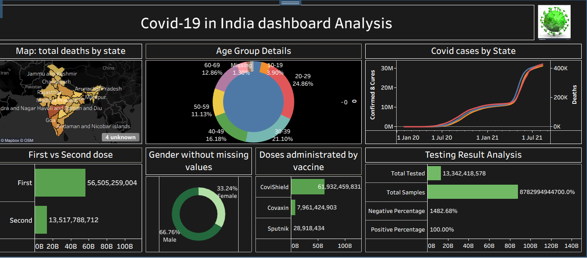

# COVID-19 Data Analysis Dashboard – Tableau

## 📊 Project Overview

This project presents an interactive COVID-19 Data Analysis Dashboard developed using Tableau.

The dashboard provides insights into COVID-19 cases, deaths, recoveries, and other pandemic-related trends using data visualization.

## 🎯 Project Objectives

- Analyze COVID-19 cases and trends
- Understand the impact of COVID-19 across regions
- Analyze confirmed cases, deaths, and recoveries
- Identify important patterns using data visualization
- Present insights through an interactive Tableau dashboard

## 🛠️ Tools & Technologies

- Tableau
- Data Visualization
- Data Analysis
- Excel / CSV

## 📈 Dashboard Features

- COVID-19 Cases Analysis
- Deaths Analysis
- Recoveries Analysis
- Regional / Country-wise Analysis
- Trend Analysis
- Interactive Filters
- KPI Visualizations

## 🖼️ Dashboard Preview

## 📂 Project Files

- Tableau Workbook – Interactive Tableau dashboard
- `Corona_Dashboard.png` – Dashboard preview
- `README.md` – Project documentation

## 💡 Key Insights

The dashboard helps visualize COVID-19 trends and provides an interactive way to explore cases, deaths, recoveries, and regional patterns.

## 👩‍💻 Project Type

Data Analytics | Data Visualization | Tableau

## 👩‍💻 Author

S. Gajapriya
